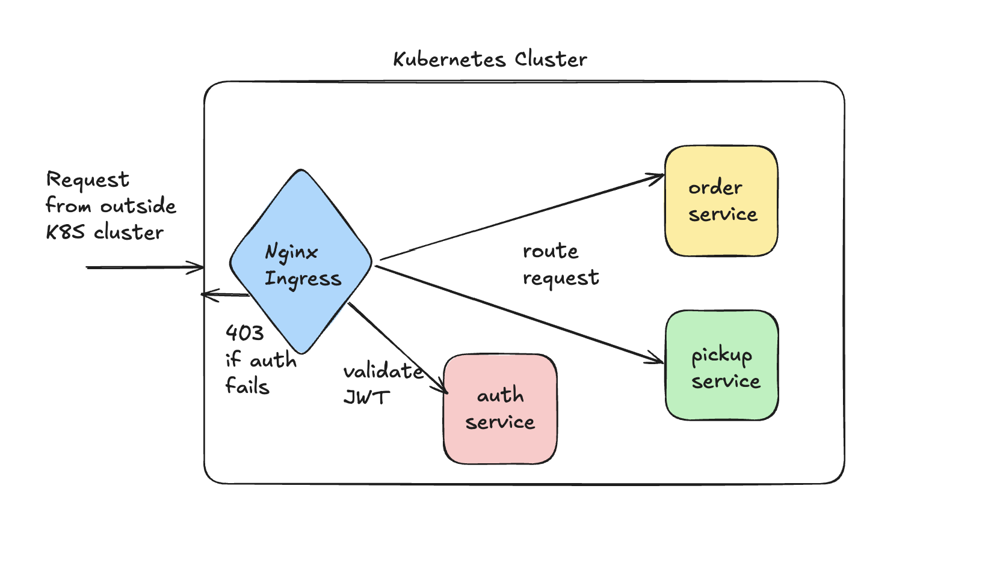

# API Gateway

## API Gateway through Kubernetes Ingress
This repository provides an API Gateway setup using Kubernetes Ingress. 


## How to run?
 - First build the docker images & load them to minikube cluster
    ```bash
      ./deployment/build_image.sh  
    ```
 - Create the Kubernetes namespace for the API Gateway
    ```bash
      kctl apply -f deployment/namespace.yml
    ```
 - Create secret for JWT. This is required for user service to validate JWT tokens.
   - Replace `<SECRET>` with your actual JWT secret.
    ```bash
      kctl create secret generic jwt-secret --from-literal=secret=<SECRET> -n api-gateway
    ```
 - Deploy the services
    ```bash
      kctl apply -f deployment/order-service.yml
      kctl apply -f deployment/order-pickup-service.yml
      kctl apply -f deployment/user-service.yml
    ```
 - Enable Nginx Ingress controller
    ```bash
      minikube addons enable ingress
    ```
 - Deploy the Ingress resource
     ```bash
      kctl apply -f deployment/user-service-ingress.yml
      kctl apply -f deployment/protected-services-ingress.yml
     ```
 - Run `minikube tunnel`
 - Add the entry to your `/etc/hosts` file
    ```bash
    127.0.0.1 api-gateway-demo.com
   ```
 - Access the API Gateway at `http://api-gateway-demo.com`