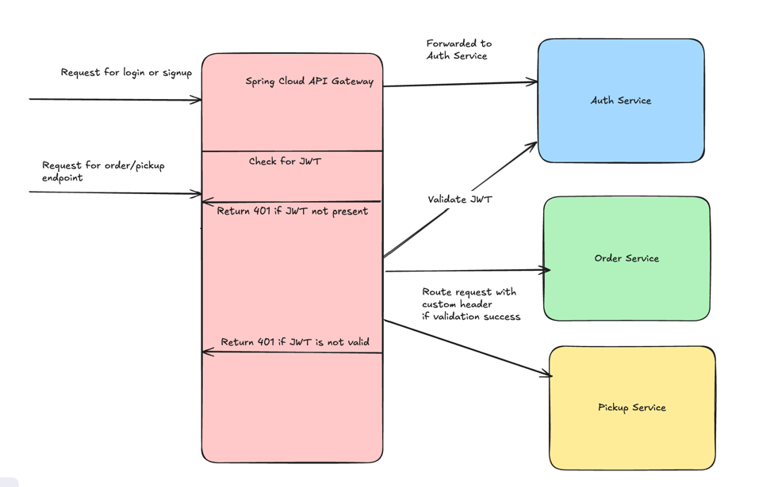

# API Gateway

## Spring API Gateway
This is a simple API Gateway built using [Spring Cloud Gateway](https://docs.spring.io/spring-cloud-gateway/reference/index.html). 
It routes requests to different microservices based on the path and provides authentication using JWT tokens.
 - User service: For auth - sends a JWT token
 - Order service: Auth via JWT & for placing order
 - Order Pickup service: Auth via JWT & for picking up orders

