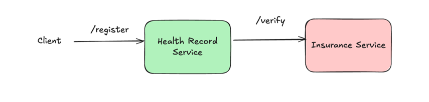

# Circuit Breaker 
 
## Spring Circuit Breaker
 - Run both `insurance-service` & `health-record-service`
 - Change `insurance-service/src/main/resources/config.txt` to `FAIL` to inject artificial failure
 - Invoke the `health-record-service` endpoint to see the circuit breaker in action

